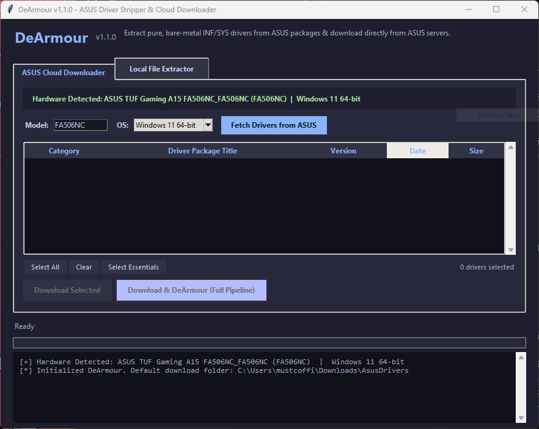

# DeArmour

[](https://www.python.org/downloads/)
[](https://opensource.org/licenses/MIT)
[](https://microsoft.com/windows)
[-orange.svg)](https://github.com/mustafakorkunc/asus-dearmour/releases)
[](tests/)

> [!NOTE]
> **Active Public Beta:** DeArmour v1.1.1 is currently in public community testing across various ASUS laptop series. Feedback, model verification reports, and bug reports are warmly welcomed via [GitHub Issues](https://github.com/mustafakorkunc/asus-dearmour/issues)!

**DeArmour** is an open-source Windows driver extraction and deployment utility designed to strip installer wrappers (such as SetupLdr, Inno Setup, or AsusSetup packages) and unpack the underlying driver payloads. It features automatic hardware detection via the Windows Registry, package discovery from official ASUS Support REST API endpoints, driver organization by hardware category, and automated Windows `pnputil` deployment script generation.

<p align="center">
  
</p>

---

## Why DeArmour Exists

Official OEM driver installers for laptops often wrap standard Windows driver files inside multi-layered executable setup wizards, bundled auxiliary software, and background update services (such as `AsusAppService` or `ASUSOptimization`). 

For clean Windows installations, specialized benchmarking environments, or minimal system configurations, installing full OEM suites can add unnecessary background processes. DeArmour addresses this by:

1. **Extracting the Driver Payload**: Locating and extracting the actual device driver files (`.inf`, `.sys`, `.cat`, and associated runtime dependencies) while discarding setup wizards and wrapper executables.
2. **Standardizing Repository Structure**: Organizing extracted drivers into clean hardware categories (Network, Audio, Bluetooth, Chipset, Input, Storage) with structured JSON manifests.
3. **Automating Native Installation**: Generating 1-click batch and PowerShell scripts that stage drivers directly into the Windows Driver Store using Microsoft's native `pnputil.exe`, requiring no setup wizards or background services.

---

## Key Capabilities

- **ASUS Support API Discovery & Hardware Detection**  
  Queries the Windows Registry (`HKLM\HARDWARE\DESCRIPTION\System\BIOS`) to detect your ASUS motherboard model code (e.g., `FA506NC`, `GA402RJ`, `UX3402VA`) and Windows OS build. Directly queries official ASUS Support REST endpoints to retrieve available packages by category, with selective downloading and processing.

- **Heuristic Binary Stream Carving**  
  Scans PE installer executables at the byte level for embedded archive signatures (`7z`, `ZIP`, `CAB`, `RAR`), carves out detected payload streams, and unpacks nested archives recursively.

- **Driver Payload Organization & Wrapper Removal**  
  Parses extracted `.inf` files to determine provider, driver class, version, date, and hardware IDs. Discards recognized installer wrappers, wizard stubs, and temporary PE sections while preserving all functional driver payload files.

- **No Telemetry or Background Services**  
  No telemetry, tracking, or background services are intentionally implemented by DeArmour. Deployed drivers are staged directly into Windows; no companion daemons or background updater tasks are installed.

- **Automated Native Deployment Scripts**  
  Generates administrative `INSTALL_ALL_DRIVERS.bat` and `INSTALL_ALL_DRIVERS.ps1` deployment scripts powered by native `pnputil.exe`, alongside a structured `drivers_catalog.json` and per-driver `install.bat` / `uninstall.bat` scripts.

- **Silent Background Extraction**  
  All internal extraction subprocesses execute with Windows `CREATE_NO_WINDOW` flags, suppressing command-prompt window popups during unpacking.

- **Dual-Mode Interface**  
  Available both as an interactive graphical interface (`dearmour-gui`) with a dark theme and as a scriptable command-line interface (`dearmour`).

---

## How It Works

DeArmour follows a modular pipeline to discover, extract, and organize drivers:

```text
[ASUS Hardware Detection]   --> Reads BaseBoardProduct & OS build from Windows Registry
           ↓
[ASUS REST API Discovery]   --> Queries GetPDDrivers endpoint for official packages
           ↓
[Package Retrieval]         --> Downloads selected official installer packages
           ↓
[Binary Stream Carving]     --> Scans PE executables for embedded archive signatures
           ↓
[Archive Extraction]        --> Unpacks outer and nested archives (ZIP, CAB, 7z, TAR)
           ↓
[Payload Organization]      --> Filters out installer wrappers; groups by device class
           ↓
[INF Metadata Parsing]      --> Extracts provider, version, date, and hardware IDs
           ↓
[Script Generation]         --> Generates pnputil deployment scripts & catalog JSON
```

---

## Supported Extraction Formats & Backends

DeArmour inspects binary files for embedded archive headers and selects an extraction backend based on format and system availability:

| Format | Magic Signature | Handling Backend | Requirement |
| :--- | :--- | :--- | :--- |
| **ZIP** | `PK\x03\x04` | Built-in (`zipfile`) | Native Python standard library |
| **CAB** | `MSCF` | Windows `expand.exe` | Native in all Windows installations |
| **7z / TAR / GZ / XZ** | `7z\xbc\xaf\x27\x1c` | Windows `tar.exe` / `7z.exe` | Native in Windows 10 (17063+) & Windows 11; enhanced by 7-Zip |
| **RAR** | `Rar!\x1a\x07` | External `7z.exe` | Requires 7-Zip installed (`7z.exe` on PATH or in default directories) |

> [!NOTE]
> While DeArmour's carver recognizes RAR magic signatures, unpacking RAR archives requires an external tool such as 7-Zip. If installed, DeArmour also uses `7z.exe` as a high-compatibility fallback for complex self-extracting (SFX) installers.

---

## Output Architecture

When DeArmour processes driver packages, it creates a standardized, organized driver repository:

```text
Extracted_Drivers/
├── INSTALL_ALL_DRIVERS.bat       # 1-Click Master Installer (Automated pnputil with UAC elevation)
├── INSTALL_ALL_DRIVERS.ps1       # PowerShell deployment script with progress reporting
├── drivers_catalog.json          # Machine-readable inventory of all extracted drivers
│
├── Network_Wireless/
│   └── Realtek_netrtwlane601_v6001.15.163/
│       ├── netrtwlane601.inf
│       ├── netrtwlane601.sys
│       ├── netrtwlane601.cat
│       ├── (driver payload dependencies)
│       ├── install.bat           # Per-driver installation script
│       ├── uninstall.bat         # Per-driver removal script
│       └── driver_manifest.json  # Driver metadata and hardware IDs
│
├── Network_Ethernet/
│   └── Realtek_rt68cx21x64_v1168.015/
│       ├── rt68cx21x64.inf
│       ├── *.sys / *.cat
│       ├── install.bat
│       ├── uninstall.bat
│       └── driver_manifest.json
│
├── Chipset_System/
│   └── AMD_amdfendr_v1.2.0.124/
│       └── ...
│
└── Bluetooth/
    └── Realtek_rtkbtfilter_v18.4038.2509/
        └── ...
```

---

## Quick Start

### Graphical User Interface (GUI)

The simplest way to use DeArmour is via the standalone Windows executable:

1. Download **`DeArmour-v1.1.1-win64.exe`** from [Releases](https://github.com/mustafakorkunc/asus-dearmour/releases).
2. Run the executable (no Python installation or dependencies required).
3. Under the **ASUS Cloud Downloader** tab:
   - Click **Detect System** to auto-fill your ASUS model and OS version.
   - Click **Fetch Drivers from ASUS** to query available official packages.
   - Select your target driver categories and click **Download & DeArmour (Full Pipeline)**.
4. Or switch to the **Local File Extractor** tab to process downloaded `.exe` installers directly.

### Command Line Interface (CLI)

#### 1. Hardware Detection
```bash
dearmour --detect
```
```text
Hardware Detection:
  Manufacturer:  ASUSTeK COMPUTER INC.
  Product Name:  ASUS TUF Gaming A15 FA506NC
  Model Code:    FA506NC
  Operating Sys: Windows 11 64-bit (ASUS OSID: 52)
  ASUS Device:   Yes
```

#### 2. Query Driver Catalog
```bash
# Query drivers for the auto-detected system
dearmour --fetch

# Query drivers for a specific model code
dearmour --fetch GA402RJ
```

#### 3. Extract Local Driver Packages
```bash
# Extract a single driver installer
dearmour "C:\Downloads\WLAN_Realtek_FA506NC.exe" -o "C:\CleanDrivers"

# Batch extract all driver installers in a folder recursively
dearmour "C:\Downloads\AsusDrivers" -o "C:\CleanDrivers" -r
```

#### 4. Launch GUI from CLI
```bash
dearmour --gui
# or
dearmour-gui
```

---

## Installation (Source Code)

DeArmour requires **Python 3.8+** on Windows 10 or 11 (CI tested across Python 3.8 through 3.13).

```bash
# Clone the repository
git clone https://github.com/mustafakorkunc/asus-dearmour.git
cd asus-dearmour

# Install in editable mode
pip install -e .
```

This installs the following console entry points:
- `dearmour`: Primary CLI utility
- `dearmour-gui`: Graphical interface
- `ade` / `asus-unpack`: Shorthand aliases

---

## Development & Testing

DeArmour includes an automated unit test suite covering hardware detection, API parsing, binary carving, INF analysis, payload organization, and script generation.

```bash
# Install test runner
pip install pytest

# Execute unit tests
pytest tests/ -v
```

All 37 unit tests run in zero-dependency simulated environments with mocked binary streams and INF descriptors.

---

## Security & Operational Boundaries

- **Binary & Archive Processing**: DeArmour processes downloaded, archive, and binary executable data. It should be run in trusted environments and should not be treated as a security sandbox.
- **Digital Signature Validation**: DeArmour parses catalog file references (`CatalogFile`) from INF descriptors, but does not perform cryptographic Authenticode verification itself. Cryptographic signature and WHQL verification are enforced by Microsoft's native `pnputil.exe` at install time according to your Windows Driver Signature Enforcement policy.
- **Hardware Compatibility**: DeArmour extracts and packages vendor-supplied driver files directly from OEM releases; underlying driver compatibility with specific Windows versions and hardware revisions is determined by the respective hardware vendor.

---

## Special Thanks & Acknowledgements

- **[Seerge](https://github.com/seerge) and the [G-Helper](https://github.com/seerge/g-helper) Project**  
  Special thanks and architectural attribution to Seerge and the G-Helper community for reverse-engineering and discovering the official ASUS Support REST API endpoints. G-Helper set the standard for lightweight, bloat-free ASUS laptop utilities and inspired DeArmour's cloud driver synchronization capabilities.

- **[Google Jules](https://jules.google.com)**  
  Contributed extensive unit testing suites (expanding test coverage to 21 unit tests) and string parsing optimizations.

- **Antigravity AI**  
  Pair programming, core engine architecture, and GUI implementation.

---

## Author & License

Created by **[Mustafa Korkunç](https://github.com/mustafakorkunc)**.

Distributed under the **MIT License**. See [`LICENSE`](LICENSE) for complete terms.
